# KIOSK-PAIRING-CLARITY-PROOF-1: review-transport copies

**Every image here is a REVIEW COPY, not evidence.** The original frames at evidence commit `41a8653c` (`../before/`, `../after/`, `../README.md`, `../MANIFEST.sha256`) and the frozen targets at `9a506766` are **unchanged and authoritative**.

**Why these copies exist** (Director handback #365 `5951677294`): the Director's environment can fetch PNGs as base64 but could not render them. Every copy here can be fetched whole:
- **Count:** 45 copies of 18 originals.
- **Size:** each ≤ 8,000 bytes; the largest is 7,580.
- **Product:** unchanged, `4537c26c` on PR #553.

## Revision 2: W4 finding #394 `5952462914`

**The defect.** The first set (`fc1da80a`) quantized each *labelled* panel as one image. The REVIEW COPY strip's yellow therefore shared palette slots with content: the frozen targets' white logo, code dots and headline came out yellow, and one strip came out green. Median cut also turned some target whites grey.

**This set fixes both:**
1. **Content and label are kept apart.** Each panel's content is quantized **on its own**. The strip is drawn in two palette entries (yellow and black) **appended after** the content's, so the label can never recolour content.
2. **The palette is chosen per panel for fidelity.** For each panel, the script picks the smallest palette, from 16 colours upward, that keeps the content's white and green pixels white and green. At each size it tries fast octree, then max coverage, then median cut, with **no dithering**.
3. **One run reproduces everything.** `make-review-copies.py` regenerates every copy and the committed `review-manifest.json` in a single invocation. That clears W4's reproducibility note.

**The acceptance check** runs inside the script on the written files and fails the run if any copy misses it. Each copy's values are recorded in the manifest. The worst values across all copies:

| measure | threshold | worst copy |
|---|---|---|
| original **white** pixels still white | ≥ 95 % | **98.8 %** |
| original **green** pixels still green | ≥ 95 % | **96.5 %** |
| white → label yellow | ≤ 20 % | **0.0 %** |
| green → label yellow | ≤ 20 % | **0.0 %** |
| strip pixels that are label yellow | ≥ 50 % | **83.2 %** |

Run against the `fc1da80a` target copies, the same yellow test **fails 6 of 13**, so the check catches the defect W4 reported.

## How the copies are made

- **Size.** BEFORE and AFTER copies keep their **native size and aspect ratio**. The two frozen targets are stored at 2560×1644, so they are **scaled ×0.5** (Lanczos) to 1280×822, and every one of their panels says so.
- **Panels.** Each frame is split into **whole horizontal panels**. No line of text is cut, and an original's panels together cover it from the top row to the bottom row (the script checks this).
  - BEFORE and AFTER frames are cut only at uniform rows.
  - Targets are cut only at rows with no high-contrast edge, away from their frame border, because their background has diagonal stripes.
- **Label strip.** Every copy carries a yellow **REVIEW COPY** strip with:
  - the original path;
  - the **full original SHA-256**;
  - the source commit;
  - the scale;
  - the panel number and source rows.
  The strip is the only thing added.
- **`review-manifest.json`, per copy:**
  - bytes, dimensions, SHA-256;
  - content and palette colour counts;
  - panel, source rows and label rows;
  - the acceptance values;
  - the original's path, commit, SHA-256, bytes and dimensions.
- **`MANIFEST.sha256`** hashes every file in this folder.

## Copies by surface: BEFORE `9a506766` · frozen TARGET · AFTER `4537c26c`

Read each column top to bottom: the panels stack back into the full frame.

### Station · waiting · 1280×800

**BEFORE**: `docs/design-target/review/kiosk-pairing-clarity-proof-1/before/station-waiting-1280x800.png` @`41a8653c`
- original: 1280×800, 72,467 bytes
- sha256 `07bf7979419953ca12e3846e07fd830eb0bfdbe9a06844aad1b08723ee5e1396`

| panel | copy | bytes | size | palette | white kept | green kept |
|---|---|---|---|---|---|---|
| 1/3 | `REVIEW-COPY-before-station-waiting-1280x800-p1of3.png` | 6,033 | 1280×358 | 16+2 | 100.0 % | 100.0 % |
| 2/3 | `REVIEW-COPY-before-station-waiting-1280x800-p2of3.png` | 7,298 | 1280×171 | 16+2 | 100.0 % | 100.0 % |
| 3/3 | `REVIEW-COPY-before-station-waiting-1280x800-p3of3.png` | 6,264 | 1280×313 | 16+2 | 100.0 % | 100.0 % |

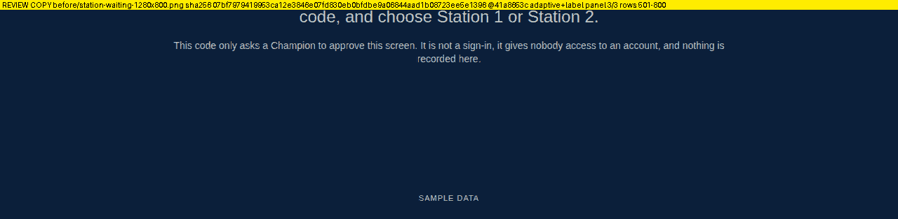

**FROZEN TARGET**: `docs/design-target/review/batch-e-room-screens/TARGET-station-pairing-waiting-1280x800.png` @`9a506766`
- original: 2560×1644, 180,309 bytes
- sha256 `df498b29955e3196776d2e84980016fc5448bddfcac6fed3d7420a9e149dd210`

| panel | copy | bytes | size | palette | white kept | green kept |
|---|---|---|---|---|---|---|
| 1/3 | `REVIEW-COPY-target-TARGET-station-pairing-waiting-1280x800-p1of3.png` | 7,153 | 1280×446 | 16+2 | 100.0 % | 100.0 % |
| 2/3 | `REVIEW-COPY-target-TARGET-station-pairing-waiting-1280x800-p2of3.png` | 6,810 | 1280×141 | 16+2 | 100.0 % | 100.0 % |
| 3/3 | `REVIEW-COPY-target-TARGET-station-pairing-waiting-1280x800-p3of3.png` | 5,556 | 1280×277 | 16+2 | 100.0 % | 100.0 % |

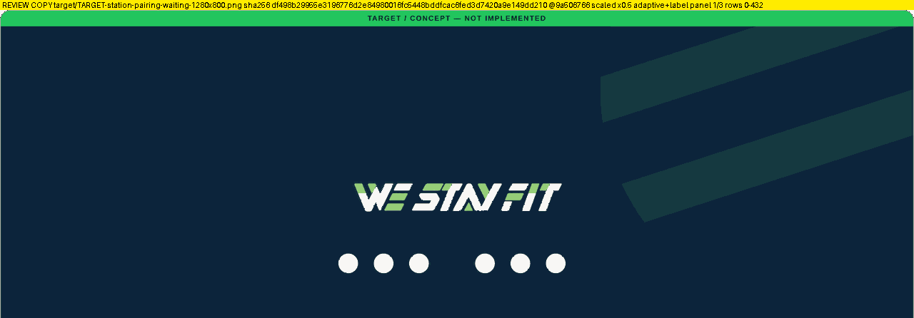

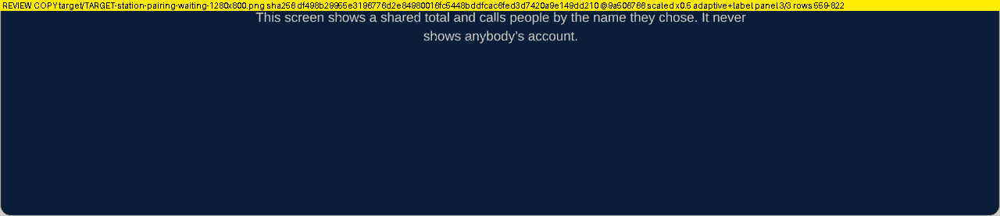

**AFTER**: `docs/design-target/review/kiosk-pairing-clarity-proof-1/after/station-waiting-1280x800.png` @`41a8653c`
- original: 1280×800, 97,054 bytes
- sha256 `e7683996439be024426c8b0c538092800a653fbe0309ecc19d20f86c2f1b41f6`

| panel | copy | bytes | size | palette | white kept | green kept |
|---|---|---|---|---|---|---|
| 1/5 | `REVIEW-COPY-after-station-waiting-1280x800-p1of5.png` | 5,779 | 1280×284 | 16+2 | 100.0 % | 100.0 % |
| 2/5 | `REVIEW-COPY-after-station-waiting-1280x800-p2of5.png` | 6,137 | 1280×179 | 16+2 | 100.0 % | 100.0 % |
| 3/5 | `REVIEW-COPY-after-station-waiting-1280x800-p3of5.png` | 6,657 | 1280×122 | 16+2 | 100.0 % | 100.0 % |
| 4/5 | `REVIEW-COPY-after-station-waiting-1280x800-p4of5.png` | 6,644 | 1280×109 | 16+2 | 100.0 % | 100.0 % |
| 5/5 | `REVIEW-COPY-after-station-waiting-1280x800-p5of5.png` | 3,032 | 1280×176 | 16+2 | 100.0 % | 100.0 % |

### Station · waiting · 390×844

**BEFORE**: `docs/design-target/review/kiosk-pairing-clarity-proof-1/before/station-waiting-390x844.png` @`41a8653c`
- original: 390×844, 41,803 bytes
- sha256 `5d500863ab0b9373becdb000025d65e69f295892af3a06b889adad8110fc2d66`

| panel | copy | bytes | size | palette | white kept | green kept |
|---|---|---|---|---|---|---|
| 1/2 | `REVIEW-COPY-before-station-waiting-390x844-p1of2.png` | 7,492 | 390×545 | 16+2 | 100.0 % | 99.4 % |
| 2/2 | `REVIEW-COPY-before-station-waiting-390x844-p2of2.png` | 4,338 | 390×375 | 16+2 | 100.0 % | 100.0 % |

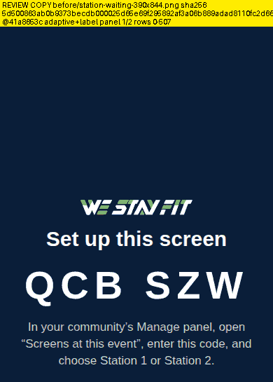
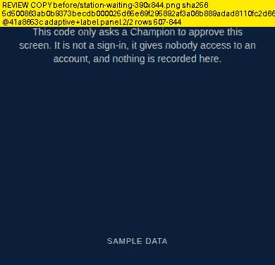

**AFTER**: `docs/design-target/review/kiosk-pairing-clarity-proof-1/after/station-waiting-390x844.png` @`41a8653c`
- original: 390×844, 57,333 bytes
- sha256 `7ebab3a139e40a798cc293c3e62c2689fd0885595c0918e6197a6c0913856bd2`

| panel | copy | bytes | size | palette | white kept | green kept |
|---|---|---|---|---|---|---|
| 1/3 | `REVIEW-COPY-after-station-waiting-390x844-p1of3.png` | 7,511 | 390×489 | 16+2 | 98.8 % | 99.4 % |
| 2/3 | `REVIEW-COPY-after-station-waiting-390x844-p2of3.png` | 7,268 | 390×211 | 16+2 | 100.0 % | 100.0 % |
| 3/3 | `REVIEW-COPY-after-station-waiting-390x844-p3of3.png` | 2,363 | 390×258 | 16+2 | 100.0 % | 100.0 % |

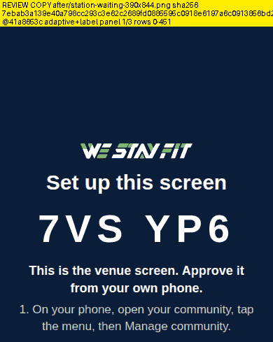
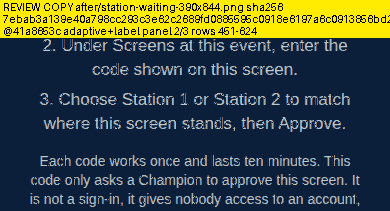
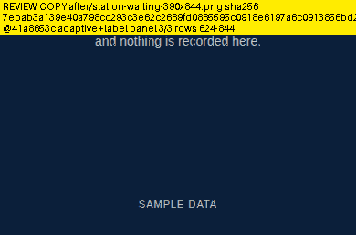

### Station · waiting · 390×640

**BEFORE**: `docs/design-target/review/kiosk-pairing-clarity-proof-1/before/station-waiting-390x640.png` @`41a8653c`
- original: 390×640, 40,602 bytes
- sha256 `ca3c94233f095a1f38fe37c9bd4112d64114eb86d844ca762a75e26208fd53cf`

| panel | copy | bytes | size | palette | white kept | green kept |
|---|---|---|---|---|---|---|
| 1/2 | `REVIEW-COPY-before-station-waiting-390x640-p1of2.png` | 7,338 | 390×443 | 16+2 | 100.0 % | 99.4 % |
| 2/2 | `REVIEW-COPY-before-station-waiting-390x640-p2of2.png` | 4,265 | 390×273 | 16+2 | 100.0 % | 100.0 % |

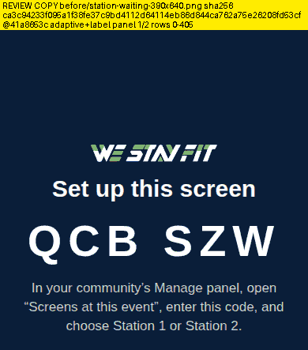
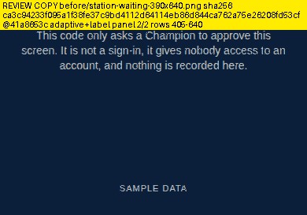

**AFTER**: `docs/design-target/review/kiosk-pairing-clarity-proof-1/after/station-waiting-390x640.png` @`41a8653c`
- original: 390×640, 56,201 bytes
- sha256 `7dcff3283798fb293ae26991ce2160fe5fa487c9f6dba04df773a05d2726e7e9`

| panel | copy | bytes | size | palette | white kept | green kept |
|---|---|---|---|---|---|---|
| 1/3 | `REVIEW-COPY-after-station-waiting-390x640-p1of3.png` | 7,327 | 390×387 | 16+2 | 98.8 % | 99.4 % |
| 2/3 | `REVIEW-COPY-after-station-waiting-390x640-p2of3.png` | 7,285 | 390×211 | 16+2 | 100.0 % | 100.0 % |
| 3/3 | `REVIEW-COPY-after-station-waiting-390x640-p3of3.png` | 2,311 | 390×156 | 16+2 | 100.0 % | 100.0 % |

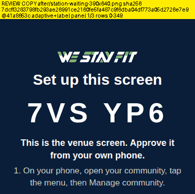
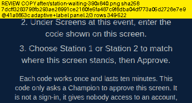
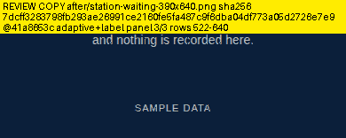

### Station · expired · 1280×800

**BEFORE**: `docs/design-target/review/kiosk-pairing-clarity-proof-1/before/station-expired-1280x800.png` @`41a8653c`
- original: 1280×800, 50,257 bytes
- sha256 `e60d95dfe66e8348ab68792bb3c2fa4705423de026c0997495818d2cb7fc7f3e`

| panel | copy | bytes | size | palette | white kept | green kept |
|---|---|---|---|---|---|---|
| 1/2 | `REVIEW-COPY-before-station-expired-1280x800-p1of2.png` | 7,042 | 1280×440 | 16+2 | 100.0 % | 98.2 % |
| 2/2 | `REVIEW-COPY-before-station-expired-1280x800-p2of2.png` | 5,468 | 1280×388 | 16+2 | 100.0 % | 98.9 % |

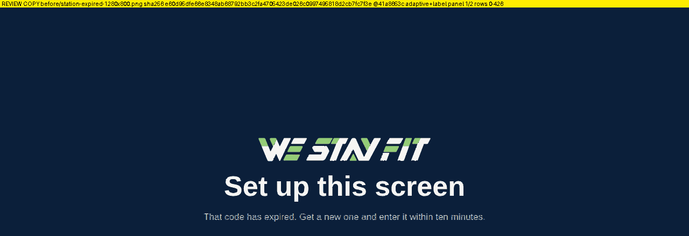
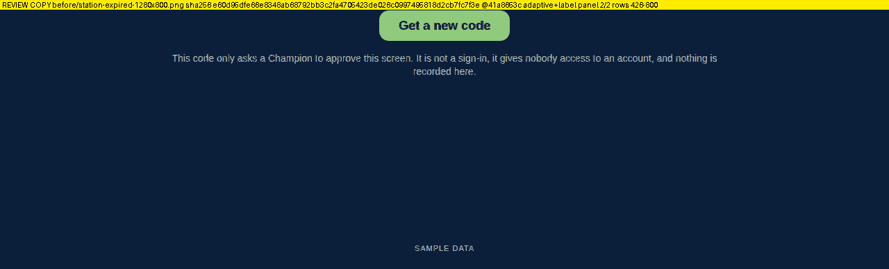

**FROZEN TARGET**: `docs/design-target/review/batch-e-room-screens/TARGET-station-pairing-expired-1280x800.png` @`9a506766`
- original: 2560×1644, 181,355 bytes
- sha256 `bd99daff8614a6ef1037452fba525eb52b24d36515dc25ae8149bccdc4490cf4`

| panel | copy | bytes | size | palette | white kept | green kept |
|---|---|---|---|---|---|---|
| 1/3 | `REVIEW-COPY-target-TARGET-station-pairing-expired-1280x800-p1of3.png` | 7,240 | 1280×400 | 16+2 | 100.0 % | 99.6 % |
| 2/3 | `REVIEW-COPY-target-TARGET-station-pairing-expired-1280x800-p2of3.png` | 6,391 | 1280×161 | 16+2 | 100.0 % | 100.0 % |
| 3/3 | `REVIEW-COPY-target-TARGET-station-pairing-expired-1280x800-p3of3.png` | 5,758 | 1280×303 | 16+2 | 100.0 % | 100.0 % |

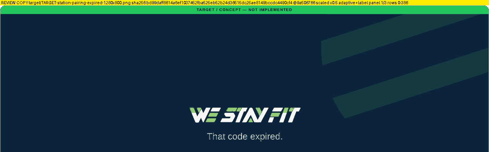

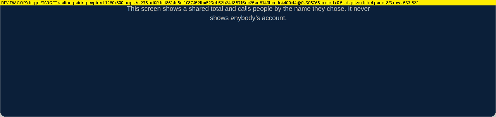

**AFTER**: `docs/design-target/review/kiosk-pairing-clarity-proof-1/after/station-expired-1280x800.png` @`41a8653c`
- original: 1280×800, 55,144 bytes
- sha256 `6f69a574bdbfb580a8d69451735da61d0dc0c8ed5bbd9482eb651494dbe80b81`

| panel | copy | bytes | size | palette | white kept | green kept |
|---|---|---|---|---|---|---|
| 1/3 | `REVIEW-COPY-after-station-expired-1280x800-p1of3.png` | 6,112 | 1280×385 | 16+2 | 100.0 % | 100.0 % |
| 2/3 | `REVIEW-COPY-after-station-expired-1280x800-p2of3.png` | 7,580 | 1280×284 | 16+2 | 100.0 % | 97.8 % |
| 3/3 | `REVIEW-COPY-after-station-expired-1280x800-p3of3.png` | 1,896 | 1280×173 | 16+2 | 100.0 % | 100.0 % |

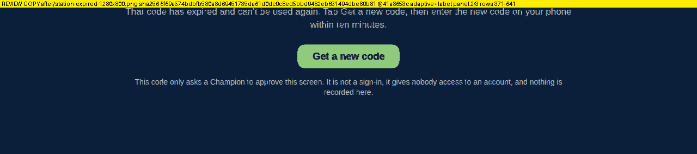

### Station · expired · 390×844

**BEFORE**: `docs/design-target/review/kiosk-pairing-clarity-proof-1/before/station-expired-390x844.png` @`41a8653c`
- original: 390×844, 33,966 bytes
- sha256 `8903140002d45b0650bdf0b63367c342f6b70f5f373172d339083ea5cfe71b64`

| panel | copy | bytes | size | palette | white kept | green kept |
|---|---|---|---|---|---|---|
| 1/2 | `REVIEW-COPY-before-station-expired-390x844-p1of2.png` | 7,349 | 390×565 | 16+2 | 100.0 % | 96.5 % |
| 2/2 | `REVIEW-COPY-before-station-expired-390x844-p2of2.png` | 2,633 | 390×355 | 16+2 | 100.0 % | 100.0 % |

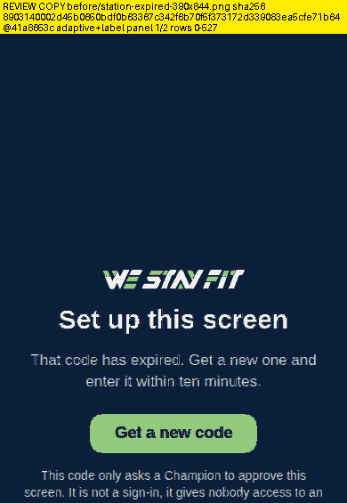
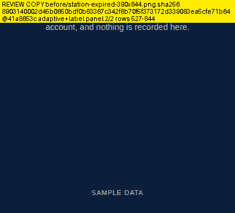

**AFTER**: `docs/design-target/review/kiosk-pairing-clarity-proof-1/after/station-expired-390x844.png` @`41a8653c`
- original: 390×844, 37,549 bytes
- sha256 `9c8a6f75db6dc3fa1e815997d5c72d10adcb64a5587c8ddf19ec5b6a47d86ea8`

| panel | copy | bytes | size | palette | white kept | green kept |
|---|---|---|---|---|---|---|
| 1/2 | `REVIEW-COPY-after-station-expired-390x844-p1of2.png` | 7,421 | 390×558 | 16+2 | 100.0 % | 96.6 % |
| 2/2 | `REVIEW-COPY-after-station-expired-390x844-p2of2.png` | 3,551 | 390×362 | 16+2 | 100.0 % | 100.0 % |

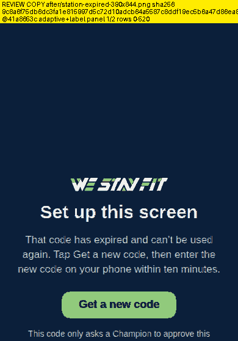
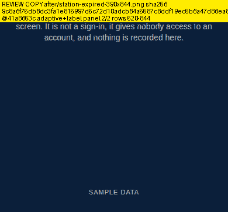

### Station · expired · 390×640

**BEFORE**: `docs/design-target/review/kiosk-pairing-clarity-proof-1/before/station-expired-390x640.png` @`41a8653c`
- original: 390×640, 32,964 bytes
- sha256 `861f4048096ec2f09e2a197bb5adfe79322887f1b41f7c7c01e0070219d34122`

| panel | copy | bytes | size | palette | white kept | green kept |
|---|---|---|---|---|---|---|
| 1/2 | `REVIEW-COPY-before-station-expired-390x640-p1of2.png` | 7,203 | 390×463 | 16+2 | 100.0 % | 96.5 % |
| 2/2 | `REVIEW-COPY-before-station-expired-390x640-p2of2.png` | 2,532 | 390×253 | 16+2 | 100.0 % | 100.0 % |

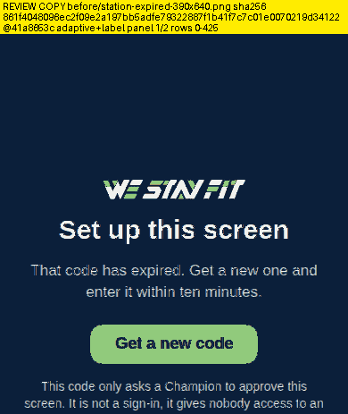
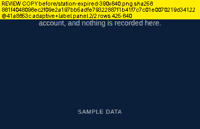

**AFTER**: `docs/design-target/review/kiosk-pairing-clarity-proof-1/after/station-expired-390x640.png` @`41a8653c`
- original: 390×640, 36,454 bytes
- sha256 `1644d5a0d28cda936aee773969beafbcde92aa2d747c3b2b2cd71a4db7581a5b`

| panel | copy | bytes | size | palette | white kept | green kept |
|---|---|---|---|---|---|---|
| 1/2 | `REVIEW-COPY-after-station-expired-390x640-p1of2.png` | 7,294 | 390×456 | 16+2 | 100.0 % | 96.5 % |
| 2/2 | `REVIEW-COPY-after-station-expired-390x640-p2of2.png` | 3,454 | 390×260 | 16+2 | 100.0 % | 100.0 % |

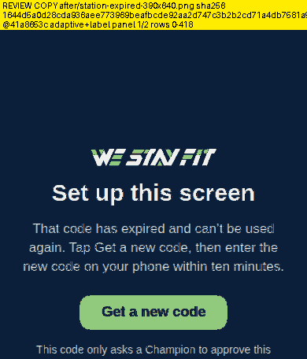
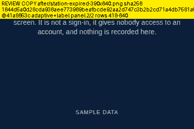

### Champion · Screens card · 390×844

**BEFORE**: `docs/design-target/review/kiosk-pairing-clarity-proof-1/before/champion-screens-card-390x844.png` @`41a8653c`
- original: 350×310, 29,633 bytes
- sha256 `cfdfee293088859373038e68180d0d28cbce827d0a7e3ea4756f4233a5cd4aa5`

| panel | copy | bytes | size | palette | white kept | green kept |
|---|---|---|---|---|---|---|
| 1/2 | `REVIEW-COPY-before-champion-screens-card-390x844-p1of2.png` | 6,890 | 350×294 | 16+2 | 100.0 % | 100.0 % |
| 2/2 | `REVIEW-COPY-before-champion-screens-card-390x844-p2of2.png` | 4,041 | 350×140 | 16+2 | 100.0 % | 100.0 % |

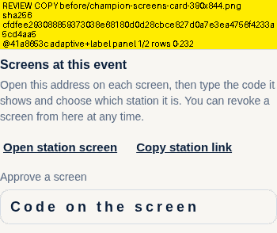
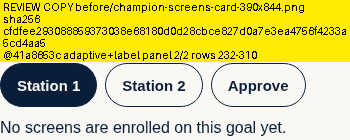

**AFTER**: `docs/design-target/review/kiosk-pairing-clarity-proof-1/after/champion-screens-card-390x844.png` @`41a8653c`
- original: 350×436, 42,910 bytes
- sha256 `bea2b4ed0314b0b47af5161caa05dd6bbad7566ed690a44ce221e56e0409affa`

| panel | copy | bytes | size | palette | white kept | green kept |
|---|---|---|---|---|---|---|
| 1/2 | `REVIEW-COPY-after-champion-screens-card-390x844-p1of2.png` | 7,514 | 350×282 | 16+2 | 100.0 % | 100.0 % |
| 2/2 | `REVIEW-COPY-after-champion-screens-card-390x844-p2of2.png` | 7,325 | 350×278 | 16+2 | 100.0 % | 100.0 % |

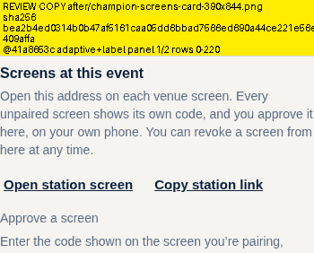
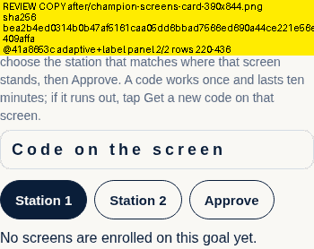

### Champion · Screens card · 390×640

**BEFORE**: `docs/design-target/review/kiosk-pairing-clarity-proof-1/before/champion-screens-card-390x640.png` @`41a8653c`
- original: 350×310, 29,634 bytes
- sha256 `e0a0ebaeebf3681f417b29c669cbe0681f6010270be044c9b36946e7d7f9addf`

| panel | copy | bytes | size | palette | white kept | green kept |
|---|---|---|---|---|---|---|
| 1/2 | `REVIEW-COPY-before-champion-screens-card-390x640-p1of2.png` | 6,878 | 350×295 | 16+2 | 100.0 % | 100.0 % |
| 2/2 | `REVIEW-COPY-before-champion-screens-card-390x640-p2of2.png` | 4,032 | 350×139 | 16+2 | 100.0 % | 100.0 % |

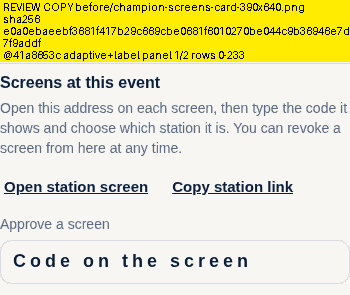
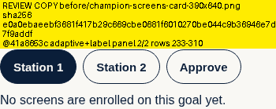

**AFTER**: `docs/design-target/review/kiosk-pairing-clarity-proof-1/after/champion-screens-card-390x640.png` @`41a8653c`
- original: 350×436, 42,912 bytes
- sha256 `3ad70aaa2cbc4110857569d126fb118e0d242169dd3b0bf6a540a4738f12bc61`

| panel | copy | bytes | size | palette | white kept | green kept |
|---|---|---|---|---|---|---|
| 1/2 | `REVIEW-COPY-after-champion-screens-card-390x640-p1of2.png` | 7,527 | 350×283 | 16+2 | 100.0 % | 100.0 % |
| 2/2 | `REVIEW-COPY-after-champion-screens-card-390x640-p2of2.png` | 7,333 | 350×277 | 16+2 | 100.0 % | 100.0 % |

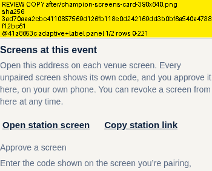

## What these copies are not

- **No recapture.** No screenshot was taken again, and nothing was rebaselined.
- **No new rendering.** No screen was drawn again for these copies.
- **No new hosting.** Nothing is published anywhere new.

Palette reduction can shift gradients and very faint background tints slightly. Use the originals named above for pixel-exact judgement; every copy's label and manifest entry carries the original's hash.
