# KIOSK-PAIRING-CLARITY-PROOF-1: review-transport copies

**Every image in this folder is a REVIEW COPY.** None is the evidence itself. The original frames at evidence commit `41a8653c` (`../before/`, `../after/`, `../README.md`, `../MANIFEST.sha256`) and the frozen targets at `9a506766` are **unchanged and authoritative**.

- **Why:** Director handback #365 `5951677294`. The Director's environment can fetch the PNGs as base64 but could not render them. These copies are small enough to retrieve whole: each is ≤ 8,000 bytes, the largest is 7,627 bytes, and there are 63 in total.
- **Product:** the subject is unchanged, `4537c26c` on PR #553. This is an evidence-only delta.

## How each copy was made (`make-review-copies.py`, Pillow, no network)

- **Colour:** each original is quantized to a 16-colour adaptive palette (median cut, **no dithering**) and saved as an optimised PNG.
- **Size:** the BEFORE and AFTER frames keep their **native size and aspect ratio**. The two frozen targets are 2560×1644 and are **scaled ×0.5** to 1280×822 (Lanczos); every one of their panels says "scaled x0.5".
- **Panels:** a frame larger than the budget is split into **whole horizontal panels**.
  - **BEFORE and AFTER frames:** cut only at uniform rows, i.e. no text and no edge.
  - **Targets:** their background has diagonal stripes, so they are cut only at rows with no high-contrast edge, away from the frame border.
  - No panel cuts a line of text. The panels of each original are contiguous and together cover every row from top to bottom; that is checked in the script.
- **Label:** every copy starts with a yellow **REVIEW COPY** strip carrying:
  - the original path;
  - the **full original SHA-256**;
  - the source commit;
  - colours and scale;
  - the panel number and the source rows it covers.
  - That strip is the only thing added. Nothing is removed or re-rendered.
- **Manifest:** `review-manifest.json` lists, for every copy:
  - bytes, dimensions, SHA-256, colours, scale, panel and source rows;
  - the original's path, commit, SHA-256, bytes and dimensions.
- **Hashes:** `MANIFEST.sha256` covers every file in this folder.

## Copies, by surface: BEFORE `9a506766` · frozen TARGET · AFTER `4537c26c`

Read each column top to bottom: the panels stack back into the full frame.

### Station · waiting · 1280×800

**BEFORE**: `docs/design-target/review/kiosk-pairing-clarity-proof-1/before/station-waiting-1280x800.png` @`41a8653c`. Original: 1280×800, 72,467 bytes, sha256 `07bf7979419953ca12e3846e07fd830eb0bfdbe9a06844aad1b08723ee5e1396`.

| panel | copy | bytes | size | sha256 |
|---|---|---|---|---|
| 1/5 | `REVIEW-COPY-before-station-waiting-1280x800-p1of5.png` | 6,316 | 1280×270 | `35dc010b7b5f9668…` |
| 2/5 | `REVIEW-COPY-before-station-waiting-1280x800-p2of5.png` | 5,137 | 1280×102 | `655ef99d4351d60a…` |
| 3/5 | `REVIEW-COPY-before-station-waiting-1280x800-p3of5.png` | 6,844 | 1280×139 | `fa81bfc2a65f621a…` |
| 4/5 | `REVIEW-COPY-before-station-waiting-1280x800-p4of5.png` | 6,720 | 1280×90 | `750d4cbe1ab28c0f…` |
| 5/5 | `REVIEW-COPY-before-station-waiting-1280x800-p5of5.png` | 6,146 | 1280×269 | `a45ab6f6ddce07ea…` |

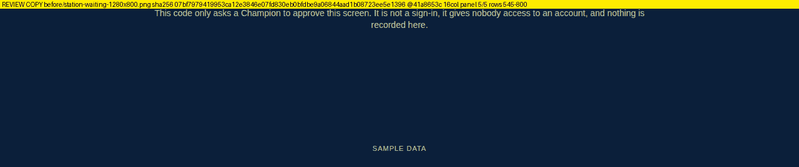

**FROZEN TARGET**: `docs/design-target/review/batch-e-room-screens/TARGET-station-pairing-waiting-1280x800.png` @`9a506766`. Original: 2560×1644, 180,309 bytes, sha256 `df498b29955e3196776d2e84980016fc5448bddfcac6fed3d7420a9e149dd210`.

| panel | copy | bytes | size | sha256 |
|---|---|---|---|---|
| 1/7 | `REVIEW-COPY-target-TARGET-station-pairing-waiting-1280x800-p1of7.png` | 5,537 | 1280×256 | `ce3891ed84d12952…` |
| 2/7 | `REVIEW-COPY-target-TARGET-station-pairing-waiting-1280x800-p2of7.png` | 6,314 | 1280×112 | `ee43d80efe7a85b7…` |
| 3/7 | `REVIEW-COPY-target-TARGET-station-pairing-waiting-1280x800-p3of7.png` | 7,286 | 1280×158 | `c165accef594f119…` |
| 4/7 | `REVIEW-COPY-target-TARGET-station-pairing-waiting-1280x800-p4of7.png` | 6,793 | 1280×42 | `f69b4950d96486f4…` |
| 5/7 | `REVIEW-COPY-target-TARGET-station-pairing-waiting-1280x800-p5of7.png` | 4,331 | 1280×61 | `cc23552efd65c12b…` |
| 6/7 | `REVIEW-COPY-target-TARGET-station-pairing-waiting-1280x800-p6of7.png` | 7,627 | 1280×56 | `d2def3143122cec2…` |
| 7/7 | `REVIEW-COPY-target-TARGET-station-pairing-waiting-1280x800-p7of7.png` | 3,230 | 1280×235 | `7aaaa5c86c8fc110…` |

**AFTER**: `docs/design-target/review/kiosk-pairing-clarity-proof-1/after/station-waiting-1280x800.png` @`41a8653c`. Original: 1280×800, 97,054 bytes, sha256 `e7683996439be024426c8b0c538092800a653fbe0309ecc19d20f86c2f1b41f6`.

| panel | copy | bytes | size | sha256 |
|---|---|---|---|---|
| 1/7 | `REVIEW-COPY-after-station-waiting-1280x800-p1of7.png` | 5,966 | 1280×196 | `e8273eca336cf5b9…` |
| 2/7 | `REVIEW-COPY-after-station-waiting-1280x800-p2of7.png` | 5,088 | 1280×102 | `bb9cc12f1b8359e3…` |
| 3/7 | `REVIEW-COPY-after-station-waiting-1280x800-p3of7.png` | 5,838 | 1280×139 | `1834db7b950203bd…` |
| 4/7 | `REVIEW-COPY-after-station-waiting-1280x800-p4of7.png` | 7,349 | 1280×86 | `e751f0c27a98150e…` |
| 5/7 | `REVIEW-COPY-after-station-waiting-1280x800-p5of7.png` | 5,478 | 1280×90 | `37c4e4ea7d2471cc…` |
| 6/7 | `REVIEW-COPY-after-station-waiting-1280x800-p6of7.png` | 5,663 | 1280×90 | `054a68811ebbdc80…` |
| 7/7 | `REVIEW-COPY-after-station-waiting-1280x800-p7of7.png` | 6,557 | 1280×195 | `a11a05445eb9ef77…` |

### Station · waiting · 390×844

**BEFORE**: `docs/design-target/review/kiosk-pairing-clarity-proof-1/before/station-waiting-390x844.png` @`41a8653c`. Original: 390×844, 41,803 bytes, sha256 `5d500863ab0b9373becdb000025d65e69f295892af3a06b889adad8110fc2d66`.

| panel | copy | bytes | size | sha256 |
|---|---|---|---|---|
| 1/3 | `REVIEW-COPY-before-station-waiting-390x844-p1of3.png` | 6,736 | 390×459 | `8984d25dd63a52db…` |
| 2/3 | `REVIEW-COPY-before-station-waiting-390x844-p2of3.png` | 6,458 | 390×143 | `9a80ae90fe4af04d…` |
| 3/3 | `REVIEW-COPY-before-station-waiting-390x844-p3of3.png` | 4,977 | 390×356 | `7aa5cf8c621fe15a…` |

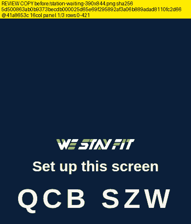
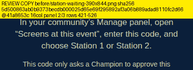
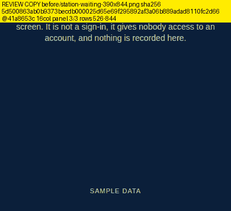

**AFTER**: `docs/design-target/review/kiosk-pairing-clarity-proof-1/after/station-waiting-390x844.png` @`41a8653c`. Original: 390×844, 57,333 bytes, sha256 `7ebab3a139e40a798cc293c3e62c2689fd0885595c0918e6197a6c0913856bd2`.

| panel | copy | bytes | size | sha256 |
|---|---|---|---|---|
| 1/4 | `REVIEW-COPY-after-station-waiting-390x844-p1of4.png` | 7,369 | 390×404 | `59f8a4685ffda38c…` |
| 2/4 | `REVIEW-COPY-after-station-waiting-390x844-p2of4.png` | 6,850 | 390×177 | `d9556f55823d0ee8…` |
| 3/4 | `REVIEW-COPY-after-station-waiting-390x844-p3of4.png` | 6,669 | 390×138 | `6c511000e1bcaba3…` |
| 4/4 | `REVIEW-COPY-after-station-waiting-390x844-p4of4.png` | 4,624 | 390×277 | `0f5747388dae6b4d…` |

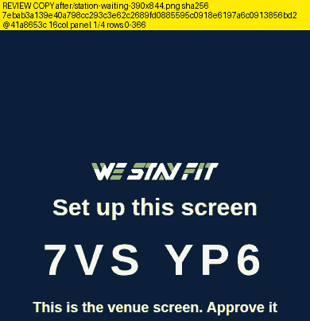
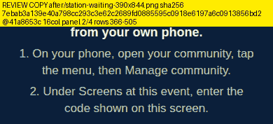
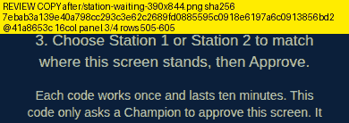
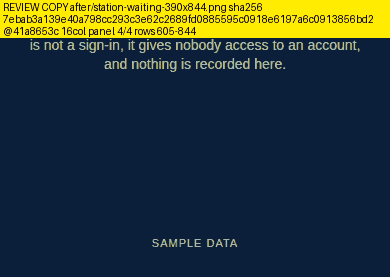

### Station · waiting · 390×640

**BEFORE**: `docs/design-target/review/kiosk-pairing-clarity-proof-1/before/station-waiting-390x640.png` @`41a8653c`. Original: 390×640, 40,602 bytes, sha256 `ca3c94233f095a1f38fe37c9bd4112d64114eb86d844ca762a75e26208fd53cf`.

| panel | copy | bytes | size | sha256 |
|---|---|---|---|---|
| 1/3 | `REVIEW-COPY-before-station-waiting-390x640-p1of3.png` | 6,564 | 390×357 | `a2195e61bdec7120…` |
| 2/3 | `REVIEW-COPY-before-station-waiting-390x640-p2of3.png` | 7,500 | 390×162 | `425819167395d3a2…` |
| 3/3 | `REVIEW-COPY-before-station-waiting-390x640-p3of3.png` | 3,724 | 390×235 | `f2296891bd65f8b9…` |

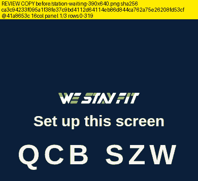
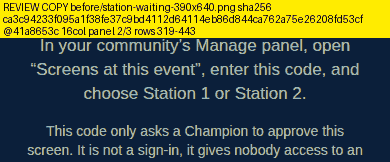
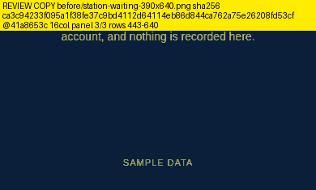

**AFTER**: `docs/design-target/review/kiosk-pairing-clarity-proof-1/after/station-waiting-390x640.png` @`41a8653c`. Original: 390×640, 56,201 bytes, sha256 `7dcff3283798fb293ae26991ce2160fe5fa487c9f6dba04df773a05d2726e7e9`.

| panel | copy | bytes | size | sha256 |
|---|---|---|---|---|
| 1/4 | `REVIEW-COPY-after-station-waiting-390x640-p1of4.png` | 7,132 | 390×302 | `70869f7c4fcba911…` |
| 2/4 | `REVIEW-COPY-after-station-waiting-390x640-p2of4.png` | 6,864 | 390×177 | `cdd9e3107ba99639…` |
| 3/4 | `REVIEW-COPY-after-station-waiting-390x640-p3of4.png` | 6,684 | 390×138 | `6852539af0e06ef7…` |
| 4/4 | `REVIEW-COPY-after-station-waiting-390x640-p4of4.png` | 4,565 | 390×175 | `a5aaef0707fc1443…` |

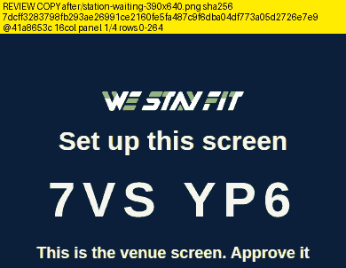
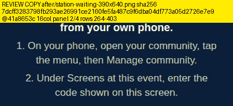
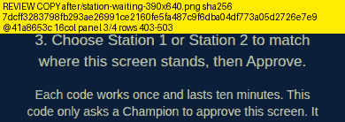
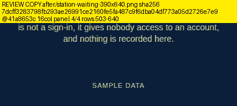

### Station · expired · 1280×800

**BEFORE**: `docs/design-target/review/kiosk-pairing-clarity-proof-1/before/station-expired-1280x800.png` @`41a8653c`. Original: 1280×800, 50,257 bytes, sha256 `e60d95dfe66e8348ab68792bb3c2fa4705423de026c0997495818d2cb7fc7f3e`.

| panel | copy | bytes | size | sha256 |
|---|---|---|---|---|
| 1/3 | `REVIEW-COPY-before-station-expired-1280x800-p1of3.png` | 6,506 | 1280×326 | `f5aa28ee826cf7ac…` |
| 2/3 | `REVIEW-COPY-before-station-expired-1280x800-p2of3.png` | 7,609 | 1280×190 | `32033a33202abafc…` |
| 3/3 | `REVIEW-COPY-before-station-expired-1280x800-p3of3.png` | 6,269 | 1280×326 | `3da7ccb0d38b9c8d…` |

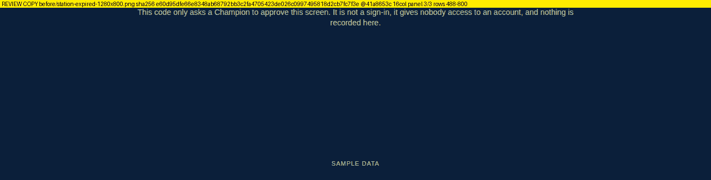

**FROZEN TARGET**: `docs/design-target/review/batch-e-room-screens/TARGET-station-pairing-expired-1280x800.png` @`9a506766`. Original: 2560×1644, 181,355 bytes, sha256 `bd99daff8614a6ef1037452fba525eb52b24d36515dc25ae8149bccdc4490cf4`.

| panel | copy | bytes | size | sha256 |
|---|---|---|---|---|
| 1/6 | `REVIEW-COPY-target-TARGET-station-pairing-expired-1280x800-p1of6.png` | 5,451 | 1280×282 | `403c8b7a2aa0e885…` |
| 2/6 | `REVIEW-COPY-target-TARGET-station-pairing-expired-1280x800-p2of6.png` | 7,554 | 1280×123 | `bc58bd7a935a0cb2…` |
| 3/6 | `REVIEW-COPY-target-TARGET-station-pairing-expired-1280x800-p3of6.png` | 7,012 | 1280×51 | `59f5d58115ef4bce…` |
| 4/6 | `REVIEW-COPY-target-TARGET-station-pairing-expired-1280x800-p4of6.png` | 6,298 | 1280×133 | `b21e39bcdd443d85…` |
| 5/6 | `REVIEW-COPY-target-TARGET-station-pairing-expired-1280x800-p5of6.png` | 6,193 | 1280×38 | `fbd5d563973d476d…` |
| 6/6 | `REVIEW-COPY-target-TARGET-station-pairing-expired-1280x800-p6of6.png` | 4,660 | 1280×279 | `47cf0298994edfd1…` |

**AFTER**: `docs/design-target/review/kiosk-pairing-clarity-proof-1/after/station-expired-1280x800.png` @`41a8653c`. Original: 1280×800, 55,144 bytes, sha256 `6f69a574bdbfb580a8d69451735da61d0dc0c8ed5bbd9482eb651494dbe80b81`.

| panel | copy | bytes | size | sha256 |
|---|---|---|---|---|
| 1/3 | `REVIEW-COPY-after-station-expired-1280x800-p1of3.png` | 6,366 | 1280×314 | `fc83a9d44c5e5a51…` |
| 2/3 | `REVIEW-COPY-after-station-expired-1280x800-p2of3.png` | 7,243 | 1280×109 | `691379af6d8f823a…` |
| 3/3 | `REVIEW-COPY-after-station-expired-1280x800-p3of3.png` | 7,452 | 1280×419 | `13af7b5e4dac965a…` |

### Station · expired · 390×844

**BEFORE**: `docs/design-target/review/kiosk-pairing-clarity-proof-1/before/station-expired-390x844.png` @`41a8653c`. Original: 390×844, 33,966 bytes, sha256 `8903140002d45b0650bdf0b63367c342f6b70f5f373172d339083ea5cfe71b64`.

| panel | copy | bytes | size | sha256 |
|---|---|---|---|---|
| 1/2 | `REVIEW-COPY-before-station-expired-390x844-p1of2.png` | 7,599 | 390×509 | `df3101099e865c73…` |
| 2/2 | `REVIEW-COPY-before-station-expired-390x844-p2of2.png` | 5,939 | 390×411 | `e5051d7dca668c74…` |

**AFTER**: `docs/design-target/review/kiosk-pairing-clarity-proof-1/after/station-expired-390x844.png` @`41a8653c`. Original: 390×844, 37,549 bytes, sha256 `9c8a6f75db6dc3fa1e815997d5c72d10adcb64a5587c8ddf19ec5b6a47d86ea8`.

| panel | copy | bytes | size | sha256 |
|---|---|---|---|---|
| 1/2 | `REVIEW-COPY-after-station-expired-390x844-p1of2.png` | 6,792 | 390×433 | `37716172bc1d7de8…` |
| 2/2 | `REVIEW-COPY-after-station-expired-390x844-p2of2.png` | 7,523 | 390×487 | `4ba8e618b3fe1e12…` |

### Station · expired · 390×640

**BEFORE**: `docs/design-target/review/kiosk-pairing-clarity-proof-1/before/station-expired-390x640.png` @`41a8653c`. Original: 390×640, 32,964 bytes, sha256 `861f4048096ec2f09e2a197bb5adfe79322887f1b41f7c7c01e0070219d34122`.

| panel | copy | bytes | size | sha256 |
|---|---|---|---|---|
| 1/2 | `REVIEW-COPY-before-station-expired-390x640-p1of2.png` | 7,439 | 390×425 | `e449bdcc02f74bab…` |
| 2/2 | `REVIEW-COPY-before-station-expired-390x640-p2of2.png` | 5,715 | 390×291 | `4eb4cdb575fb7a88…` |

**AFTER**: `docs/design-target/review/kiosk-pairing-clarity-proof-1/after/station-expired-390x640.png` @`41a8653c`. Original: 390×640, 36,454 bytes, sha256 `1644d5a0d28cda936aee773969beafbcde92aa2d747c3b2b2cd71a4db7581a5b`.

| panel | copy | bytes | size | sha256 |
|---|---|---|---|---|
| 1/2 | `REVIEW-COPY-after-station-expired-390x640-p1of2.png` | 6,689 | 390×331 | `f3679916405387ef…` |
| 2/2 | `REVIEW-COPY-after-station-expired-390x640-p2of2.png` | 7,558 | 390×385 | `38ff539d4743864e…` |

### Champion · Screens card · 390×844

**BEFORE**: `docs/design-target/review/kiosk-pairing-clarity-proof-1/before/champion-screens-card-390x844.png` @`41a8653c`. Original: 350×310, 29,633 bytes, sha256 `cfdfee293088859373038e68180d0d28cbce827d0a7e3ea4756f4233a5cd4aa5`.

| panel | copy | bytes | size | sha256 |
|---|---|---|---|---|
| 1/2 | `REVIEW-COPY-before-champion-screens-card-390x844-p1of2.png` | 7,566 | 350×294 | `38e9e7c314c644fe…` |
| 2/2 | `REVIEW-COPY-before-champion-screens-card-390x844-p2of2.png` | 5,232 | 350×140 | `370bc9c6a26bd3af…` |

**AFTER**: `docs/design-target/review/kiosk-pairing-clarity-proof-1/after/champion-screens-card-390x844.png` @`41a8653c`. Original: 350×436, 42,910 bytes, sha256 `bea2b4ed0314b0b47af5161caa05dd6bbad7566ed690a44ce221e56e0409affa`.

| panel | copy | bytes | size | sha256 |
|---|---|---|---|---|
| 1/3 | `REVIEW-COPY-after-champion-screens-card-390x844-p1of3.png` | 7,215 | 350×237 | `d5996a8e917f31ee…` |
| 2/3 | `REVIEW-COPY-after-champion-screens-card-390x844-p2of3.png` | 7,076 | 350×245 | `d4111fb3e391e06b…` |
| 3/3 | `REVIEW-COPY-after-champion-screens-card-390x844-p3of3.png` | 5,153 | 350×140 | `acddcdc8e70371fd…` |

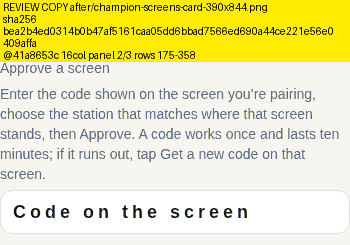
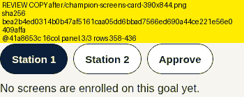

### Champion · Screens card · 390×640

**BEFORE**: `docs/design-target/review/kiosk-pairing-clarity-proof-1/before/champion-screens-card-390x640.png` @`41a8653c`. Original: 350×310, 29,634 bytes, sha256 `e0a0ebaeebf3681f417b29c669cbe0681f6010270be044c9b36946e7d7f9addf`.

| panel | copy | bytes | size | sha256 |
|---|---|---|---|---|
| 1/2 | `REVIEW-COPY-before-champion-screens-card-390x640-p1of2.png` | 7,251 | 350×239 | `9437e5db4a5711a5…` |
| 2/2 | `REVIEW-COPY-before-champion-screens-card-390x640-p2of2.png` | 5,892 | 350×195 | `2c35d70593529092…` |

**AFTER**: `docs/design-target/review/kiosk-pairing-clarity-proof-1/after/champion-screens-card-390x640.png` @`41a8653c`. Original: 350×436, 42,912 bytes, sha256 `3ad70aaa2cbc4110857569d126fb118e0d242169dd3b0bf6a540a4738f12bc61`.

| panel | copy | bytes | size | sha256 |
|---|---|---|---|---|
| 1/3 | `REVIEW-COPY-after-champion-screens-card-390x640-p1of3.png` | 7,413 | 350×238 | `0d745d1459c5fcb7…` |
| 2/3 | `REVIEW-COPY-after-champion-screens-card-390x640-p2of3.png` | 7,094 | 350×245 | `354875eef480ad2e…` |
| 3/3 | `REVIEW-COPY-after-champion-screens-card-390x640-p3of3.png` | 5,197 | 350×139 | `a6418b1ba1c35b84…` |

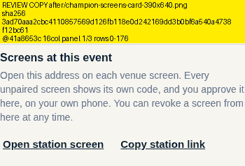
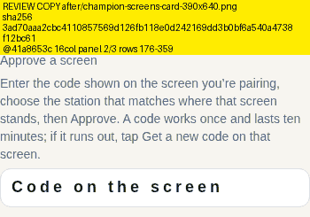
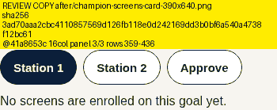

## What these copies are not

- **Not a re-capture or a rebaseline:** no screenshot was taken again.
- **Not a new render:** nothing on screen was drawn again for these copies.
- **Not hosted anywhere new:** they live only on the evidence branch.

Quantization can shift a gradient's tone slightly. For pixel-exact judgement, use the originals named above; their hashes are in each copy's label and in the manifest.
